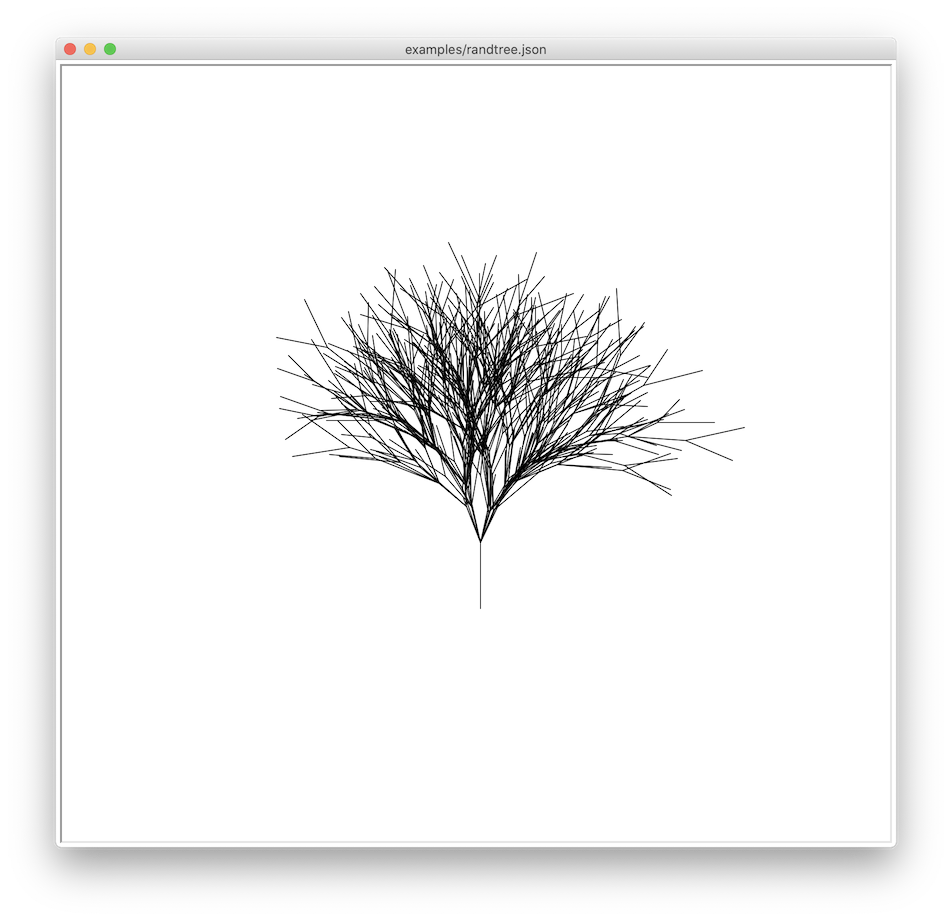

# L-System renderer

This repository contains an implementation of an *L-System* renderer. 

## What is an L-System?

An *L-system* or *Lindenmayer system* is a parallel rewriting system and a type of formal grammar. An L-system consists of an *alphabet of symbols* (`actions`) that can be used to make strings, a collection of *production rules* (`rules`) that expand each symbol into some larger string of symbols, an initial *axiom string* (`axiom`) from which to begin construction, and a mechanism for translating the generated strings into geometric structures. (From [Wikipedia](https://en.wikipedia.org/wiki/L-system)).

For example a binary tree can be described in L-System as:
```python
actions = {
    "A": "draw_forward", 
    "B": "draw_forward",
    "+": "left_turn",
    "-": "right_turn",
    "[": "save_state",
    "]": "restore_state"
}
rules = {
    "A": "B[+A]-A",
    "B": "BB"
}
axiom = "A"
angle = 30
```

The `angle` parameter defines the angle of the left or right turns in degrees.

When rendering the L-System one might define how much time the substition rules should be applied, in order words the maximum depth of the recursions. This parameter is called `order`.

## Usage

The LSystem library provides a default symbol -> actions mapping that conforms the [Inkspace](https://inkscape.org) L-System renderer conventions. So at minimum you should specify only the `rules` map, the initial `axiom` and the turn `angle`:

```python
from lsystem import LSystem

tree_renderer = LSystem(rules, axiom, angle)
tree_renderer.execute(tree_renderer.axiom, order=4, unit=10)
```

The `LSystem` class also contains a convenience `demo` method that draws the curve with the predefined parameters:

```python
tree_renderer.demo()
```

### json support

You can initialize the `LSystem` class also from a json file:

```python
LSystem.from_json("examples/levyc.json").demo()
```

For the available json keys refer to the documentation of the `LSystem()` constructor.

### Command line interface

```
$ python lsystem.py -h
usage: lsystem.py [-h] [-u UNIT] [-o ORDER] [-t] input_file

L-System renderer

positional arguments:
  input_file               json definition of the L-System

optional arguments:
  -h, --help               show this help message and exit
  -u UNIT, --unit UNIT     base unit of the drawing in pixels
  -o ORDER, --order ORDER  depth of the recursion
  -t, --trace              print tracing info to stdout

Click on the drawing window to exit.
```

## Examples





